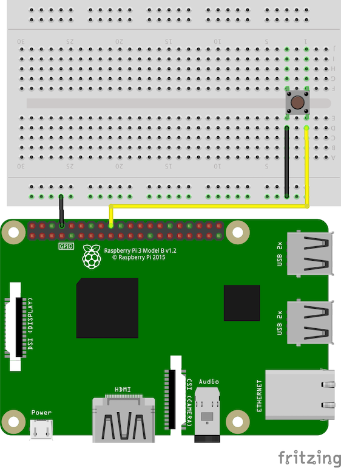

# 03-read-button-press

Reads when a button is pressed/depressed and reports status when connected to a Raspberry
PI 3 B+ and prints output to the terminal indicating whether the button is currently
pressed. Assumes the following wiring:

- Button END1 to RasPi GND
- Button END2 to RasPi GPIO24

To run, execute the python script:

```bash
$ python main.py
```

You should see the screen output whether the button is currently pressed/depressed.

## Circuit Diagram


