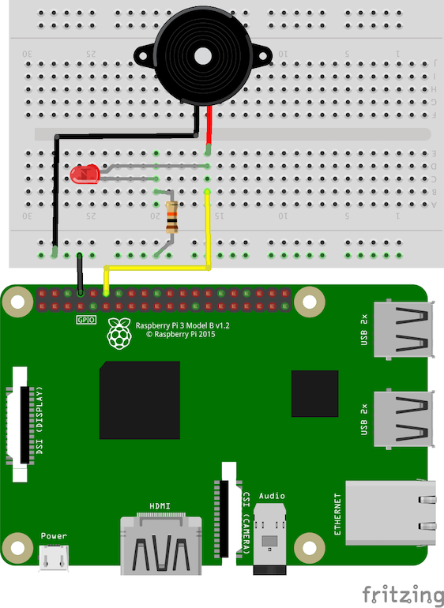

# 04-gui-buzzer

Using the tkinter library, instantiates a GUI allowing a user to toggle a buzzer on/off
when connected to a Raspberry PI 3 B+. Note that you MUST use an *active buzzer* for this
circuit as the circuit assumes a built-in oscillator. The project assumes the following
wiring connections, including an LED to indicate on/off (for testing):

- Active Buzzer POS(+) to RasPi GPIO18
- Active Buzzer NEG(-) to RasPi GND
- LED POS(+) to RasPi GPIO18
- LED NEG(-) to 1k Ohm Resistor to RasPi GND

To run, execute the python script:

```bash
$ python main.py
```

You should then see a GUI pop up where you can control a Buzzer on/off functionality,
which will also toggle the LED on/off to demonstrate things are working as expected.

## Circuit Diagram


