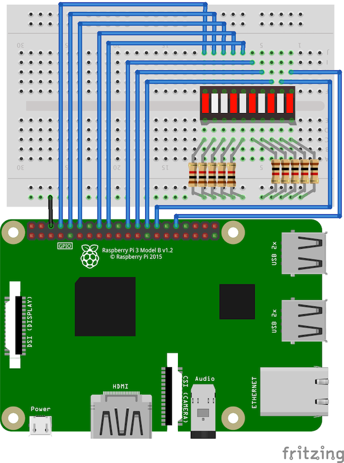

# 07-light-bar-graph

Lights up various LEDs on a light bar graph (10 segment) connected to a Raspberry PI 3 B+. Assumes
the following wiring setup (if your LED bar doesn't work after wiring like the below, simply flip it
over as you have most likely oriented it incorrectly):

- LED BAR TOP PIN1 to RasPi GPIO14
- LED BAR TOP PIN2 to RasPi GPIO15
- LED BAR TOP PIN3 to RasPi GPIO18
- LED BAR TOP PIN4 to RasPi GPIO23
- LED BAR TOP PIN5 to RasPi GPIO24
- LED BAR TOP PIN6 to RasPi GPIO25
- LED BAR TOP PIN7 to RasPi GPIO8
- LED BAR TOP PIN8 to RasPi GPIO7
- LED BAR TOP PIN9 to RasPi GPIO1
- LED BAR TOP PIN10 to RasPi GPIO12
- LED BAR BOTTOM (ALL PINS) to Resistor Network
- Resistor Network PIN1 (dot) to RasPi GND

The above uses a Bourns-style resistor network in 101 circuit fashion (meaning PIN1 is a line to all
resistor outputs in the network and can be attached to ground to adequately complete the circuit).
If you wish to use standard resistors, simply apply a roughly 1k Ohm resistor between each BOTTOM pin
in the light bar and RasPi GND.

The resistor network used in this tutorial were 2x 8-pin, 101 circuit networks - one of them was flipped
so that PIN1 was excluded from the light bar on each end, and each PIN1 was attached to the RasPi GND. The
specific marking on the resistor network was 8x-1-102LF indicating 8 pins (1 pin straight, 7 resistive pins),
101 circuit (each of 7 pins resistive, single straight backbone connecting all resistive pins out via PIN1),
8,200 Ohms total (102LF). Data sheet can be found [here](https://www.bourns.com/PDFs/4600X.pdf), referencing
the diagram on "Bussed Resistors (101 Circuit)".

To run, execute the python script:

```bash
$ python main.py
```

You should see the LEDs on the light bar illuminate in a sequence.

## Circuit Diagram


