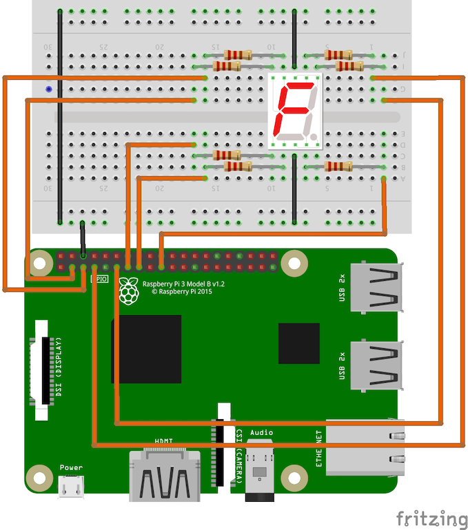

# 08-7seg-led-display

Lights up numbers on a 7-segment LED display (single digit) connected to a Raspberry PI 3 B+.
Assumes the following configuration for the display:

```bash
G F COM A B
| |  |  | |
|---------|
|    A    |
| F     B |
|    G    |
| E     C |
|    D  dp|
|---------|
| |  |  | |
E D COM C DP
```

Based on the above, assumes the following wiring (based on BCM pin numbering):

- LED G to 220 Ohm Resistor to RasPi GPIO2 (PIN3)
- LED F to 220 Ohm Resistor to RasPi GPIO3 (PIN5)
- LED A to 220 Ohm Resistor to RasPi GPIO4 (PIN7)
- LED B to 220 Ohm Resistor to RasPi GPIO17 (PIN11)
- LED E to 220 Ohm Resistor to RasPi GPIO27 (PIN13)
- LED D to 220 Ohm Resistor to RasPi GPIO22 (PIN15)
- LED C to 220 Ohm Resistor to RasPi GPIO10 (PIN19)
- LED DP (not wired)
- LED COM (BOTH) to RasPi GND

The above uses a common-cathode style 7-segment LED display (model 5611AH). If you are using a common
anode display, the wiring diagram in this tutorial will not hold/will not work, nor will the code.

To run, execute the python script:

```bash
$ python main.py
```

You should see digits appearing/cycling on the display.

## Note About Logic

The logic in this circuit is associated with a "positive write where segment is needed". For instance,
considering the above pin layout for the common-cathode display, displaying the number "2" would mean
needing to light up segments A, B, G, E, and D. In array-order, this means placing a "1" in positions
for the required segments needing to be lit, and a 0 otherwise. The number 2, as seen in the code,
results in the following array:

```bash
# A  B  C  D  E  F  G
 [1, 1, 0, 1, 1, 0, 1]
```

## Circuit Diagram


