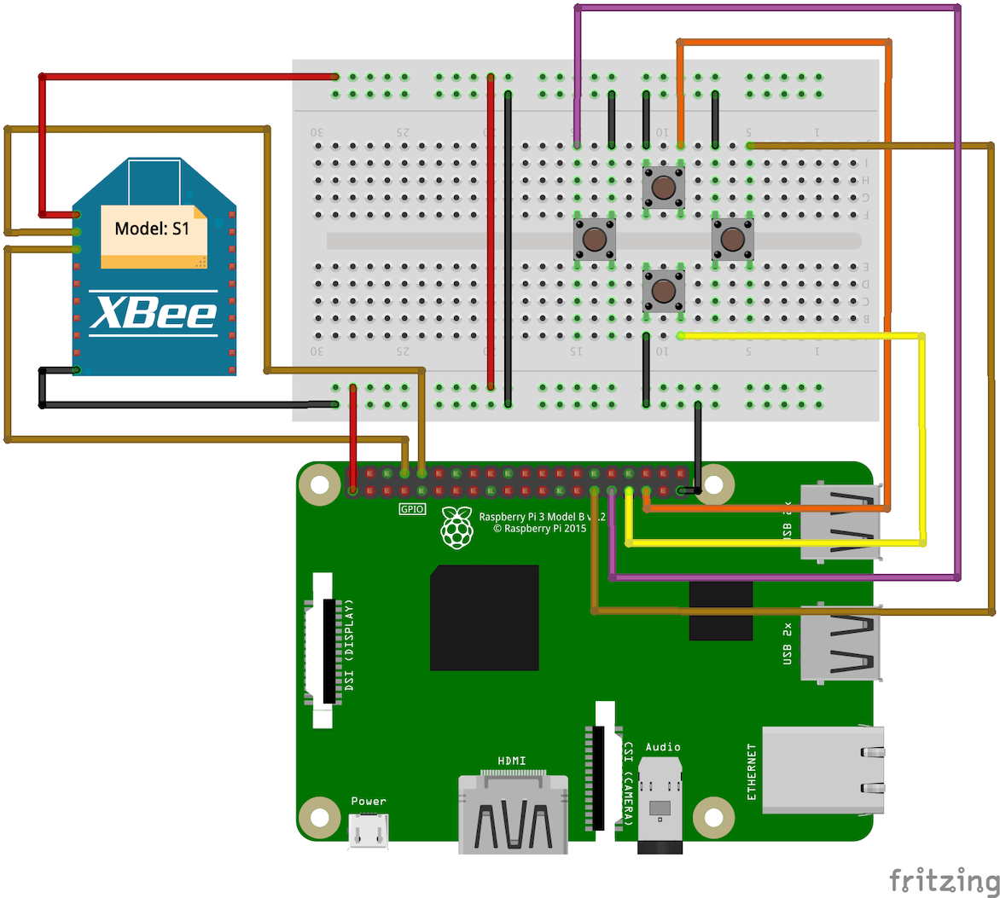
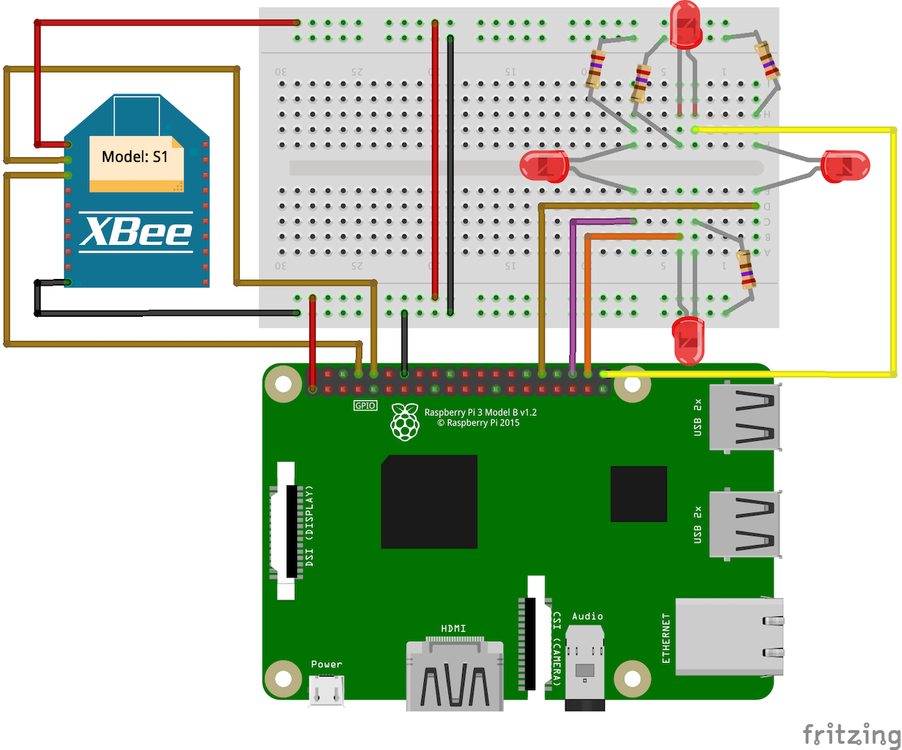

# 11-xbee-send-receive

Using 2 XBee Series 1 (S1) modules, enables sending/receiving/controlling outputs
to simulate remote control of devices. The configuration assumes the following:

**Transmitter**:

- Raspberry PI Model 3 B+
- XBee Series 1 (S1)
- 4x push-buttons

**Receiver**:

- Raspberry PI Model 3 B+
- XBee Series 1 (S1)
- 4x LEDs
- 4x 270 Ohm Resistors

**Miscellaneous**:
- XCTU Software
- Wires

**WARNING**: This project *requires* Python 3.x due to the Xbee library
used within the tutorial. Please ensure you use `python3` executables and
other similar Python 3 respective commands.

## XBee Readiness

The XBee devices must first be programmed appropriately in order for the Python XBee library
to work as expected. In this tutorial, we used an Arduino Duemilanove with an attached XBee
[Shield](https://shieldlist.org/libelium/xbee) (details can be found [here](https://www.arduino.cc/en/Main/ArduinoXbeeShield)).
In order for the XBee to be programmable through the Arduino-attached XBee shield, the ATMega
chip on the Arduino board must be either removed or shorted. The easiest way to accomplish this
is to connect the RESET and GND connections on the Arduino with a single wire, thereby bypassing
the ATMega chip.

Once the ATMega chip has been bypassed and the XBee Shield (and associated XBee device) have been
connected, plug a USB cable into the Arduino board and connect it to a computer running the XCTU
software. Once connected, select "Add a radio module". In the dialog that appears, you should see
your XBee show up (on a MacBook Pro, this shows as something similar to "usbserial-A400fGEG"). Select
the USB device, leaving all other settings as default, and select "Finish".

When the configuration window shows (gear icon selected in the upper right corner, and XBee device
selected in left device selector), click the "Default" icon (looks like a factory for factory settings)
and proceed to the next step below...

**THIS NEXT STEP IS IMPORTANT**

The XBee must be configured for API mode. Under the "Serial Interfacing" section in the configuration
settings, update the "AP API Enable" parameter to be "API enabled [1]". This puts the XBee in API,
no-escape mode, which is what the Xbee Python library expects (and is anyways required if you end up
having more than 2 XBee devices at a time).

If you wish to configure a specific channel and PAN ID for the network of devices you're building, feel
free to do so (just ensure both XBee modules have the same PAN ID and corresponding Channel).

Once completed, click the "Write" icon at the top of the configuration page to write the changes to
the XBee module (configure it).

Repeat the same exact steps as above for your second XBee module. Ideally, you would have the first *and*
second module plugged in at the same time and configured so you can use the "Console" feature of XCTU
to verify that messages are sent/received by each XBee, indicating they have been correctly configured.

You can now move on to wiring the XBee modules according to the circuit diagrams below:

**Transmitter**:



For the control/button (transmitter) circuit (Raspberry PI B+ First Instance):

*Buttons*:

- UP button PIN1 to RasPi1 GPIO19 (PIN35)
- DOWN button PIN1 to RasPi1 GPIO13 (PIN33)
- LEFT button PIN1 to RasPi1 GPIO6 (PIN31)
- RIGHT button PIN1 to RasPi1 GPIO5 (PIN29)
- UP button PIN2 to RasPi1 GND
- DOWN button PIN2 to RasPi1 GND
- LEFT button PIN2 to RasPi1 GND
- RIGHT button PIN2 to RasPi1 GND

*XBee*:

- XBee VCC to RasPi1 +3.3V
- XBee GND to RasPi1 GND
- XBee DOUT to RasPi1 UART0_RXD (PIN10)
- XBee DIN to RasPi1 UART0_TXD (PIN8)

**Receiver**:


For the LED (receiver) circuit (Raspberry PI 3 B+ Second Instance):

*LEDs*:

- UP LED NEG to 270 Ohm Resistor to RasPi2 GND
- UP LED POS to RasPi2 GPIO21 (PIN40)
- DOWN LED NEG to 270 Ohm Resistor to RasPi2 GND
- DOWN LED POS RasPi2 GPIO20 (PIN38)
- LEFT LED NEG to 270 Ohm Resistor to RasPi2 GND
- LEFT LED POS RasPi2 GPIO16 (PIN36)
- RIGHT LED NEG to 270 Ohm Resistor to RasPi2 GND
- RIGHT LED POS RasPi2 GPIO12 (PIN32)

*XBee*:

- XBee VCC to RasPi2 +3.3V
- XBee GND to RasPi2 GND
- XBee DOUT to RasPi2 UART0_RXD (PIN10)
- XBee DIN to RasPi2 UART0_TXD (PIN8)

## Raspberry PI Readiness

In order for the Raspberry PI to be able to use the UART ports (GPIO14/PIN8 and GPIO15/PIN10),
they first need to be removed from serial console use (default for the Raspbery PI).
In order to do this, launch the Raspberry PI configuration utility:

```bash
$ sudo raspi-config
```

Once the configuration utility is showing, navigate to "5 Interfacing Options" ->
"P6 Serial", and select "No" for all options to enable. Quit the configuration utility,
but do *not* elect to reboot (yet).

Once the Serial console has been disabled, ensure the UART is enabled. Open the `config.txt`
file and search for `enable_uart`, and ensure it is set to "1":

```bash
$ sudo vim /boot/config.txt
# search for and ensure the following line exists:
#   enable_uart=1
```

Once the above have completed, trigger a reboot of the Raspberry PI for the new settings to
take effect:

```bash
$ sudo reboot
```

## Python Virtual Environment Setup

Next we'll install a virtual environment given the Python version being run is
different than the rest of the projects in this repository:

```bash
$ sudo pip3 install virtualenv
$ virtualenv .env
$ .env/bin/activate

# verify you are using Python 3
$ python --version
# should output something similar to:
#   Python 3.5.3
```

Once the virtual environment has been configured, install the respective packages needed
for the tutorial:

```bash
$ pip install -r requirements.txt
```

## Execution

There are 2 scripts in this project. Once the circuits have been wired appropriately (see
circuit diagrams below) you can execute each script in a separate terminal window to enable
both receive and transmit functionality at the same time:

```bash
# in terminal window 1 - receiver
$ python receiver.py

# in terminal window 2 - transmitter
$ python transmitter.py
```

If all goes well, you sould be able to press each of the push-buttons and see the corresponding
LED light up, indicating messages are being passed/transmitted from the transmitter to the receiving
XBee instance.
