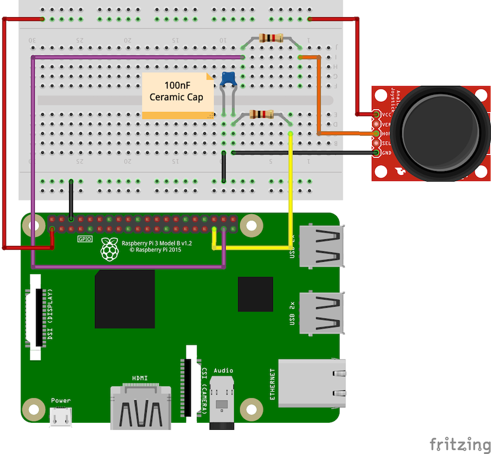

# 12-joystick-no-adc

Prints out values for an analog Joystick (using an Analog 2-axis Thumb Joystick from Adafruit, specs
located [here](http://adafru.it/512)) connected to the Raspberry Pi 3 B+. This particular circuit does
not use an analog-to-digital converter and since the Raspberry Pi has no analog inputs (as of this
version), the circuit will use a "charging" mechanism to simulate analog inputs. Although the resolution
and accuracy won't be as good as an ADC, it should set the basis for interacting with the Joystick and
should allow for raw left/right or up/down switching. Assumes the following circuit layout:

- Joystick VCC to RasPi +3.3V (PIN1)
- Joystick XOUT/HOR to 1k Ohm Resistor to RasPi GPIO26 (PIN37)
- Joystick GND to 100nF Capacitor PIN1
- 100nF Capacitor PIN2 to RasPi GND
- 100nF Capacitor PIN1 to RasPi GPIO19 (PIN35)
- Joystick GND to RasPi GND

Some of the schematic and details were taken from the following post:

[Building Raspberry Pi Controllers Part 5: Reading Analog Data with an RPi](https://www.allaboutcircuits.com/projects/building-raspberry-pi-controllers-part-5-reading-analog-data-with-an-rpi/)

The logic is similar to the "09-photocell" project - discharge a capacitor, then immediately start to charge
the capacitor and increment a counter (time) until the measure pin on the Raspberry PI reaches a "HIGH"
state, which for 3.3V Raspberry Pi source, means roughly a 1.6V capacitor voltage. Once a "HIGH" state is
reached on the measure pin, stop the counter and report the results. Depending on the timing thresholds,
print whether the joystick is in a low/high or left/right state (assuming the x-axis wire has been connected
to the Raspberry Pi sensor pin). Note that the thresholds in the script will likely need to be adjusted
depending on the type of load you have on the Raspberry Pi overall, which could impact the overall charge
timing. Simply adjust the `LEFT_THRESHOLD` and `RIGHT_THRESHOLD` numbers to reflect your left and right
limits, respectively.

To run, execute the python script:

```bash
$ python main.py
```

You should see a numeric value indicating the timing of the charge, as well as an indicator about whether
the joystick is in an left/center/right position based on the `LEFT_THRESHOLD` and `RIGHT_THRESHOLD` values
(assuming you have your x-axis cable hooked to the Raspberry Pi sensor pin).

## Circuit Diagram


