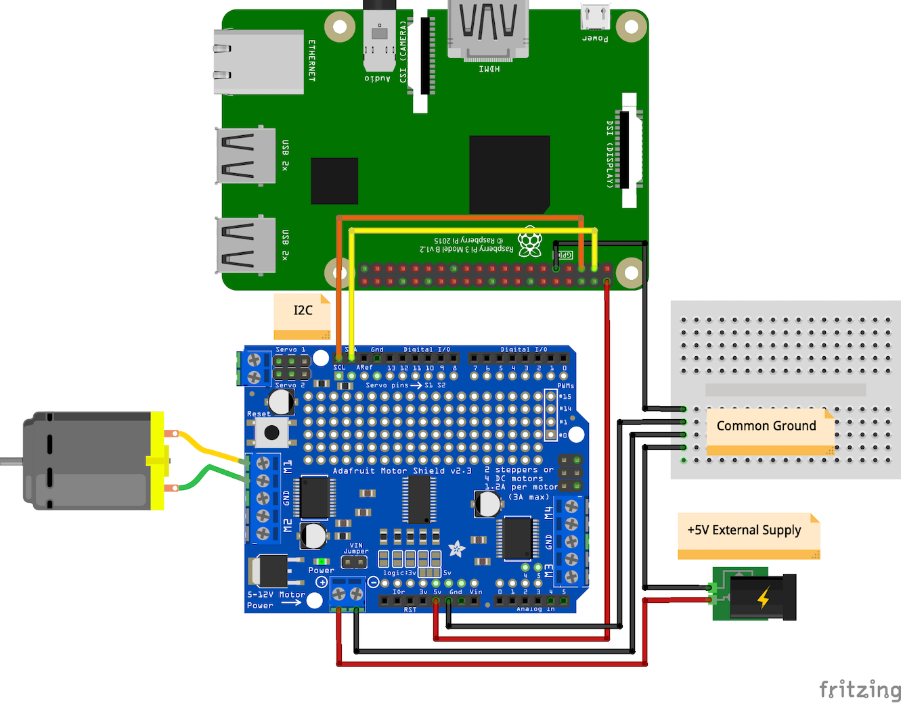

# 13-arduino-motor-shield-integration

Integration with an Adafruit Arduino Motor Shield (V2) (http://www.adafruit.com/products/1438). 
Although this shield is built for the Arduino series boards, it can be modified/used in other
applications. This tutorial will use the board connected to a Raspberry Pi 3 B+ with the following
pin configurations ("Arduino Motor Controller Shield" referenced as "AMC" below). Note that this
tutorial uses a DC motor:

- AMC VCC screw terminal connected to *external* +5V Power Supply VCC - powers motors
- AMC M1 (2-pin) screw terminal connected to Wire1 and Wire2 on DC Motor
- AMC +5V pin connected to RasPi +5V (PIN2) - powers chips/circuitry on board
- AMC SCL pin connected to RasPi SCL1 (PIN5)
- AMC SDA pin connected to RasPi SDA1 (PIN3)
- RasPi GND/Motor Shield GND Pin/External +5V GND all connected (Common Ground)
- Arduino Motor Shield VIN Jumper **REMOVED**

Note that much of the code was built using the examples from the Adafruit "MotorHAT" Python library
which is used within this tutorial. The specific example used can be found
[here](https://raw.githubusercontent.com/adafruit/Adafruit-Motor-HAT-Python-Library/master/examples/DCTest.py).

## Raspberry PI Readiness

In order for the Raspberry Pi to be able to communicate with the motor board using I2C, the I2C interface
needs to be enabled. This can be performed through the built-in Raspberry Pi configuration utility:

```bash
$ sudo raspi-config
```

When the configuration dialog opens, navigate to "5 Interfacing Options" -> "P5 I2C", and select "Yes"
to enable the I2C interface. You should not need to reboot the Pi at this point.

To check whether everything is functioning as expected, we'll next connect the I2C wires from the Raspberry
Pi to the motor board (if you have not yet done so). Connect Raspberry Pi (BCM) PIN3, which is now SDA1,
into the SDA pin of the Arduino motor shield, and then connect Raspberry Pi (BCM) PIN5, which is now SCL1,
into the SCL pin of the Arduino motor shield. At this point, the I2C connections should be set (obviously
ensure you have all other power/ground connections hooked up as well in order for the chips/circuit to
function as expected).

On the Raspberry Pi, you can use the `i2c-tools` package to detect I2C devices connected to the Pi. Install
the package and run the `i2cdetect` utility:

```bash
$ sudo apt-get install i2c-tools
$ sudo i2cdetect -y 1
```

Upon running the `i2cdetect` command with "1" as the argument (indicating device 1 - do *NOT* use device 0 or
device 0 ports on the Raspberry Pi as these are specifically reserved for EEPROM devices), you should see a
list of i2c addresses show up where the motor board is connected.

## Python Virtual Environment Setup

Next we'll install a virtual environment given the Python version being run is different than many of the
other projects in this repository (this requires Python 3):

```bash
$ sudo pip3 install virtualenv
$ virtualenv .env
$ .env/bin/activate

# verify you are using Python 3
$ python --version
# should output something similar to:
#   Python 3.5.3
```

Once the virtual environment has been configured, install the respective packages needed
for the tutorial:

```bash
$ pip install -r requirements.txt
```

## Execution

Now that you have the circuit wired, I2C connected, and your Python 3 and associated dependencies installed,
you can kick off the script:

```bash
$ python main.py
```

If all goes well, you should see your DC motor rotate in an accelerating forward/backward fashion!

## Circuit Diagram


