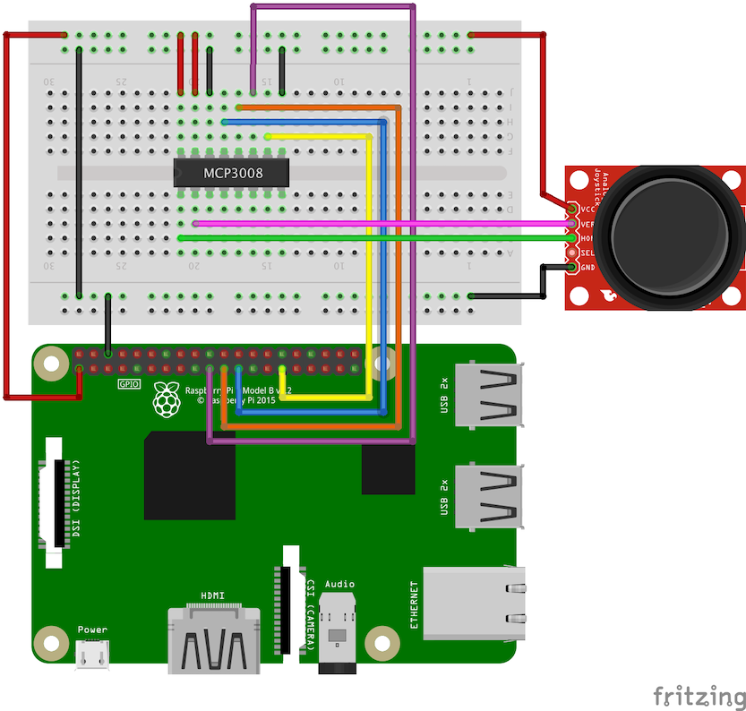

# 14-joystick-with-adc

Prints out values for an analog Joystick (using an Analog 2-axis Thumb Joystick from Adafruit, specs
located [here](http://adafru.it/512)) connected to the Raspberry Pi 3 B+ with an MCP3008 analog to
digital converter (ADC). This tutorial is an improvement tutorial over the no-ADC read in 12-joystick-no-adc
as it provides much better resolution/accuracy in the reading with a single IC and no external capacitor
or charging circuits. The library used to communicate with the MCP3008 is the Adafruit CircuitPython SPI
library for the MCP3008. Assumes the following wiring:

- MCP3008 VDD (PIN16) to RasPi +3.3V (PIN1)
- MCP3008 VREF (PIN15) to RasPi +3.3V (PIN1)
- MCP3008 AGND (PIN14) to RasPi GND (PIN6)
- MCP3008 CLK (PIN13) to RasPi SPICLK (PIN23)
- MCP3008 DOUT (PIN12) to RasPi SPIMISO (PIN21)
- MCP3008 DIN (PIN11) to RasPi SPIMOSI (PIN19)
- MCP3008 CS/SHDN (PIN10) to RasPi GPIO5 (PIN29)
- MCP3008 DGND (PIN9) to RasPi GND (PIN6)
- MCP3008 CH0 to Joystick XOUT/HOR
- MCP3008 CH1 to Joystick YOUT/VER
- Joystick VCC to RasPi +3.3V (PIN1)
- Joystick GND to RasPi GND (PIN6)

The following diagram lists the MCP3008 chip and associated pins:

```bash
     |-------\_/------|
CH0 =|1             16|= VDD
     |                |
CH1 =|2             15|= VREF
     |                |
CH2 =|3             14|= AGND
     |                |
CH3 =|4             13|= CLK
     |                |
CH4 =|5             12|= DOUT
     |                |
CH5 =|6             11|= DIN
     |                |
CH6 =|7             10|= CS/SHDN
     |                |
CH7 =|8              9|= DGND
     |----------------|
```

Some of the schematic and details were taken from the following post:

[MCP3008](https://learn.adafruit.com/mcp3008-spi-adc/python-circuitpython)

## Raspberry PI Readiness

In order for the Raspberry Pi to be able to communicate with the motor board using SPI, the SPI interface
needs to be enabled. This can be performed through the built-in Raspberry Pi configuration utility:

```bash
$ sudo raspi-config
```

When the configuration dialog opens, navigate to "5 Interfacing Options" -> "P4 SPI", and select "Yes"
to enable the SPI interface. You should reboot the Pi after performing this step.

## Python Virtual Environment Setup

Next we'll install a virtual environment given the Python version being run is different than many of the
other projects in this repository (this requires Python 3):

```bash
$ sudo pip3 install virtualenv
$ virtualenv .env
$ .env/bin/activate

# verify you are using Python 3
$ python --version
# should output something similar to:
#   Python 3.5.3
```

Once the virtual environment has been configured, install the respective packages needed
for the tutorial:

```bash
$ pip install -r requirements.txt
```

## Execution

Now that you have the circuit wired, SPI connected, and your Python 3 and associated dependencies installed,
you can kick off the script:

```bash
$ python main.py
```

If all goes well, you should see analog values being printed to the screen and changing when you move/adjust
the joystick.

## Circuit Diagram


