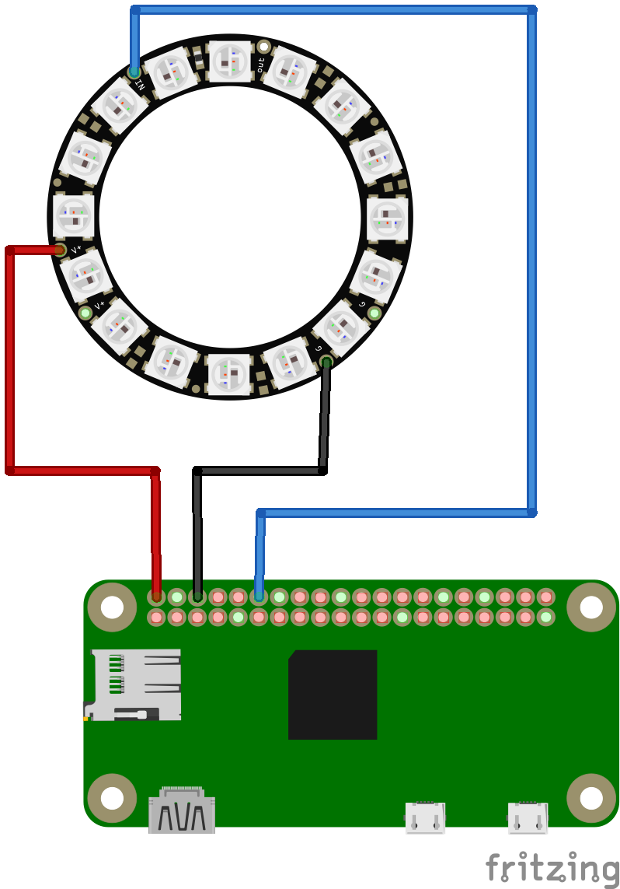

# 19-neopixel-ring

Using the Adafruit NeoPixel Python library, cycles through a few different visual effects
which light up a NeoPixel 16-LED ring.

**WARNING**: Connecting the NeoPixel directly to a Raspberry Pi is likely not a good idea
if you have a decent number of LEDs as the power draw is not supported by the Raspberry Pi
(and could damage it). Instead, look to use a separate +5V power supply for the NeoPixels
with a level shifter and/or diode for isolation.

The project assumes a NeoPixel 16-LED ring and the following wiring connections:

- NeoPixel Ring DIN to RasPi GPIO18
- NeoPixel Ring POS(+) to RasPi POS +5V
- NeoPixel Ring NEG(-) to RasPi GND

## Prerequisites

The NeoPixel Python library requires Python 3 to be installed as well as several Python 3
libraries. Most Raspberry Pi OS-es (including Raspbian which is what was used here) come
pre-loaded with Python 3. However, you likely need to install `pip` and the other libraries
required for the NeoPixel libraries to function:

```bash
$ sudo apt-get -y install python3-pip
$ sudo pip3 install rpi_ws281x adafruit-circuitpython-neopixel
```

## Usage

To run, execute the python script - note that this script requires Python 3 and needs to be
run as the root user in order to adequately control the output pins.

**Note**: If you have a NeoPixel that is different than the 16-pin ring used in this tutorial,
edit the script and update the `NUM_PIXELS` parameter for however many pixels you have in your
NeoPixel. Remember if you drive a significant number of pixels (>16), you likely want to ensure
you are using an external power supply for the LEDs and *not* the Raspberry Pi +5V output.

```bash
$ sudo python3 main.py
```

You should then see your NeoPixel ring go through several iterations (looping) of each function
implemented. Send a SIGINT signal (CTRL-C) when you wish to have the script terminate and the
ring LEDs reset/blank themselves.

## Circuit Diagram


