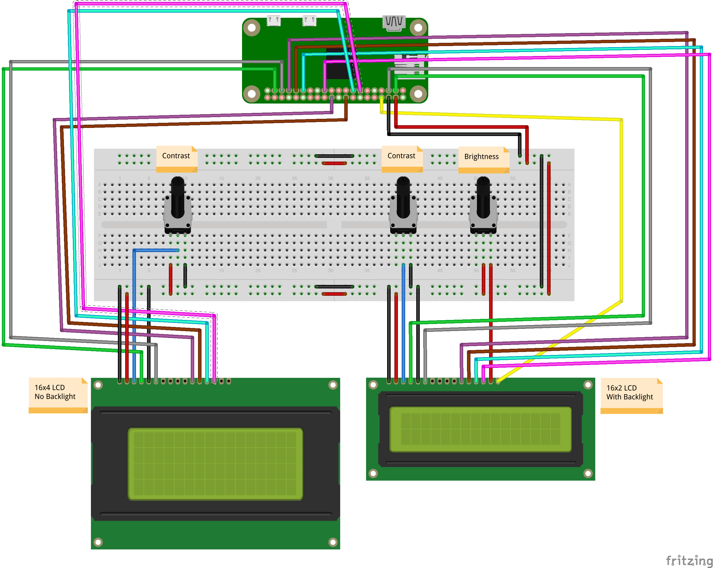

# 20-dual-lcd-displays-updating

Print various information on 2x LCD displays. The following devices are expected:

- **LCD_4X**: 16x4 characters without a backlight
- **LCD_4X_POT1**: potentiometer for contrast control for 16x4 character LCD
- **LCD_2X**: 16x2 characters with a mono (single color/white) backlight
- **LCD_2X_POT1**: potentiometer for contrast control for 16x2 character LCD
- **LCD_2X_POT2**: potentiometer for backlight brightness control for 16x2 character LCD

Assumes the following wiring - note that it is not ideal to utilize the Raspberry Pi 5V output pins
as they are not likely to be sufficient to support longer-term current draws (it is better to utilize
a dedicated +5V external power source for this effort):

- LCD_4X PIN1 (VSS) to RasPi GND
- LCD_4X PIN2 (VDD) to RasPi +5V
- LCD_4X PIN3 (VO) to LCD_4X_POT1 CENTER PIN
- LCD_4X PIN4 (RS) to RasPi GPIO26
- LCD_4X PIN5 (RW) to RasPi GND
- LCD_4X PIN6 (EN) to RasPi GPIO19 
- LCD_4X PIN7-PIN10 (NOT USED)
- LCD_4X PIN11 (D4) to RasPi GPIO25
- LCD_4X PIN12 (D5) to RasPi GPIO24
- LCD_4X PIN13 (D6) to RasPi GPIO22
- LCD_4X PIN14 (D7) to RasPi GPIO27
- LCD_4X PIN15 (A) (NOT USED - NO BACKLIGHT)
- LCD_4X PIN16 (K) (NOT USED - NO BACKLIGHT)
- LCD_4X_POT1 RIGHT PIN to RasPi GND
- LCD_4X_POT1 LEFT PIN to RasPi +5V


- LCD_2X PIN1 (VSS) to RasPi GND
- LCD_2X PIN2 (VDD) to RasPi +5V
- LCD_2X PIN3 (VO) to LCD_2X_POT1 CENTER PIN
- LCD_2X PIN4 (RS) to RasPi GPIO2
- LCD_2X PIN5 (RW) to RasPi GND
- LCD_2X PIN6 (EN) to RasPi GPIO3
- LCD_2X PIN7-PIN10 (NOT USED)
- LCD_2X PIN11 (D4) to RasPi GPIO13
- LCD_2X PIN12 (D5) to RasPi GPIO6
- LCD_2X PIN13 (D6) to RasPi GPIO5
- LCD_2X PIN14 (D7) to RasPi GPIO11
- LCD_2X PIN15 (LED Anode) to LCD_2X_POT2 RIGHT PIN
- LCD_2X PIN16 (LED Cathode) to RasPi GPIO14
- LCD_2X_POT1 RIGHT PIN to RasPi GND
- LCD_2X_POT2 CENTER PIN to RasPi +5V

First, prerequisites must be installed:

```bash
$ pip install -r requirements.txt
```

Next, to run, execute the python script:

```bash
$ python main.py
```

After running the application, you should see some text printed to each of the LCD screens.
This text should update (such as the time seconds) regularly, with various updates interwoven
in other intervals.

## Circuit Diagram


