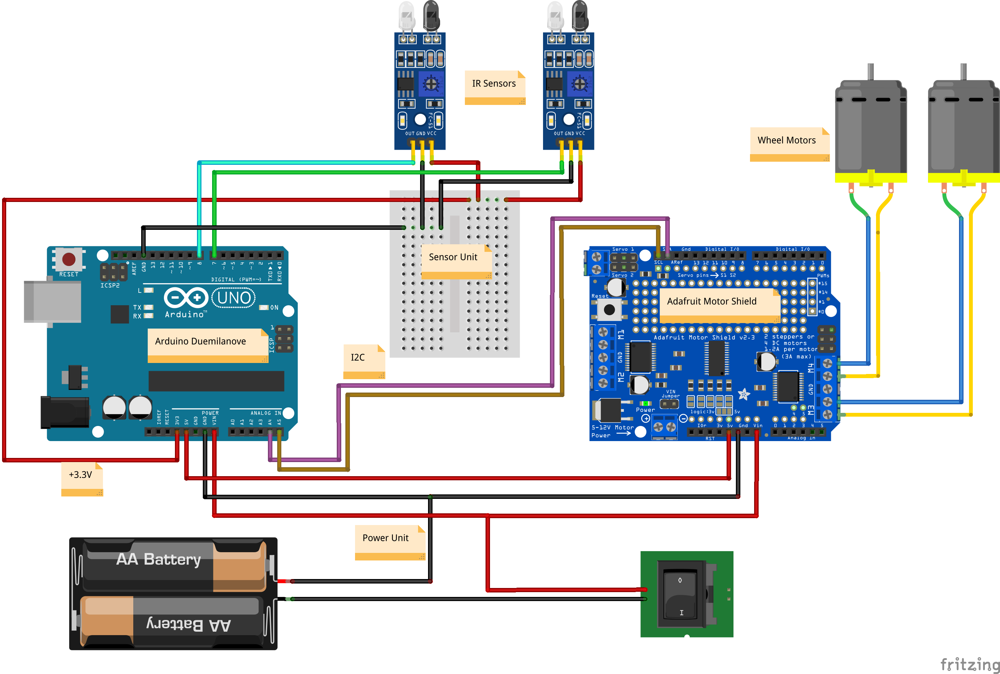

# arduo--line-follower-bot

Implementation of an autonomous sensor robot that uses line-follower sensors and can automatically
navigate following a dark line painted on the ground.

## Warning

The Adafruit Arduino motor shield used in this project was stacked on top of an Arduino Duemilanove. However,
initially it was found that this causes the Arduino to go into a permanent reset loop. Whether this is bad
soldering or a design flaw is irrelevant - if you intend to stack the shield, make sure the shield `RST` pin
does *NOT* make contact with the Arduino `RST` pin or else nothing will appear to be working.

## Usage

Simply connect the circuit components according to the diagram (along with a rolling robot chassis) and
upload the Arduino code to the Duemilanove. Power on the device and set it on top of a dark/black line. The
bot will use the line to navigate its way around a room.

**Note**: You will most likely need to tune the IR sensors using the potentiometer that comes with them on
the board. Adjust this potentiometer until the on/off behavior you expect occurs.

## Circuit Diagram

