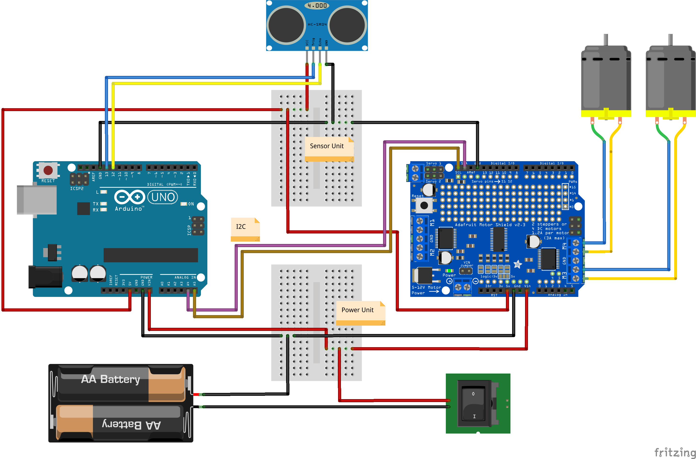

# arduo--sensor-bot

Implementation of an autonomous sensor robot that uses a distance sensor to avoid obstacles with an
Arduino Duemilanove controller.

## Usage

Simply connect the circuit components according to the diagram (along with a rolling robot chassis) and
upload the Arduino code to the Duemilanove. Power on the device and let it roll - it will move forward,
and when it comes close to an obstacle detected by the front-loaded distance sensor, it will make a back/turn
movement to chart a new course away from the object.

## Circuit Diagram

