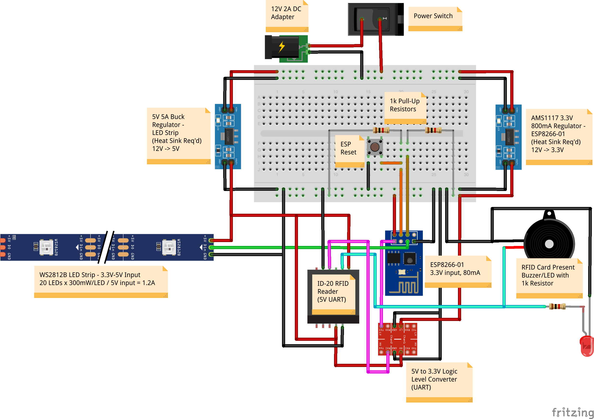

# esp8266--busy-free-indicator

Implementation of a busy/free indicator circuit that uses the ESP8266-01 controller, an ID-20 RFID sensor,
a WS2812B LED strip, and various other components to allow for remote control of a green/red free/busy
LED indicator.

## Prerequisites

Note that in order for the ESP code to compile, the following zip files are required (can be zipped using the
"download as zip" option under the `Clone` option of the respective repositories in GitHub):

* `ESPAsyncTCP-master.zip`
* `ESPAsyncWebServer-master.zip`

Flashing the ESP8266-01 can be done using a custom flash device referenced in
[this post](https://jekhokie.github.io/esp8266/wifi/arduino/electronics/2019/01/25/esp8266-temp-sensor.html).

To upload the SPIFFS web content, you need to use the
[Arduino ESP8266 Filesystem Uploader](https://github.com/esp8266/arduino-esp8266fs-plugin).  Follow the instructions
in that link to get this tool installed and functioning.

In addition, ensure you update the `esp8266--busy-free-indicator.ino` project file to specify your wireless
SSID and password so that the ESP8266-01 can successfully connect to the wireless internet.

## Usage

See the circuit diagram for details - once the circuit is turned on, the `auto-detect.sh` script can be used
to automatically launch the web-based control center for controlling busy/free, and an RFID badge can be
scanned (with the correct badge ID, configured in the ESP8266-01 code) to flash the current busy/free status
if the device is powered on but in `off` mode.

## Circuit Diagram

