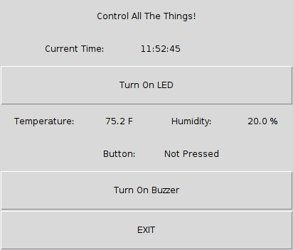

# gui-master-controller

Growing master project which will present as a command/control GUI for reading sensor
values, enabling control of sensors and outputs, etc. As basic projects are added to the
repository, they should eventually show up as functionality on this master control screen.
This repository is for a master GUI to be developed and control sensors using the tkinter
GUI framework but will eventually be replaced with a nicer dashboard or web-based command
and control framework.

Please reference existing projects for connectivity information. As of writing, the following
projects have been integrated (wiring assumptions should be obtained from these project
README.md documents, respectively):

- 1-gui-led
- 2-read-temp-humidity
- 3-read-button-press

To run, execute the python script:

```bash
$ python main.py
```

You should see a GUI appear showing various values based on previous sensors integrated. Below
is a sample screenshot that shows all sensors through project 3 (3-read-button-press):


