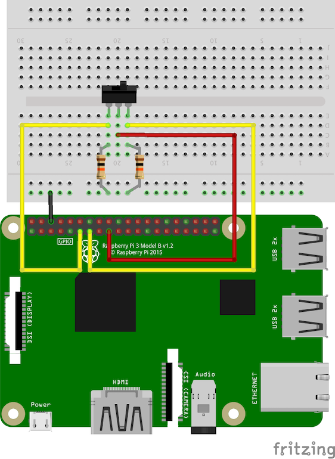

# raspi3--05-slide-2way-switch

Checks the status of a 2-way, 3-pin switch connected to a Raspberry PI 3 B+ and print the
status of whether the switch is in position 1 (LEFT) or position 2 (right). Assumes the following
wiring setup:

- SWITCH MIDDLE PIN to RasPi +3.3V
- SWITCH LEFT PIN to RasPi GPIO17
- SWITCH RIGHT PIN to RasPi GPIO27
- SWITCH LEFT PIN to 10k Ohm Resistor to RasPi GND (parallel)
- SWITCH RIGHT PIN to 10k Ohm Resistor to RasPi GND (parallel)

To run, execute the python script:

```bash
$ python main.py
```

Adjusting the switch, you should see the status updated to which state the switch is in (polled
every 1 second).

## Circuit Diagram


