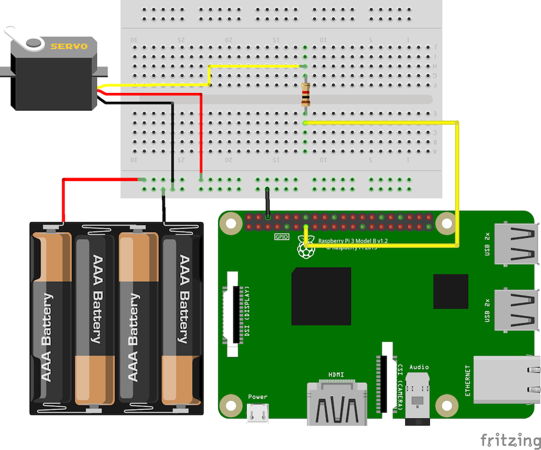

# raspi3--10-gui-servo

Control a servo connected to a Raspberry PI 3 B+ using a slider within a GUI. This circuit requires
a separate external +5V Power Supply to power the Servo as the Raspberry Pi will not be able to adequately
power the servo from its power pins. Assumes the following wiring for the circuit:

- Servo SIG/PWM to 1k Ohm Resistor to RasPi GPIO27 (PIN13)
- Servo VCC to +5V Power Supply POS(+)
- Servo GND to RasPi GND/+5V Power Supply GND (Joined)
- RasPi GND to +5V Power Supply GND

Note: The Servo used in this tutorial was a Kuman SG90 (KY66) mini-servo.

To run, execute the python script:

```bash
$ python main.py
```

You should be able to adjust the slider to control the Servo motor. Ensure that the Servo external
+5V power supply is turned on/plugged in.

## Circuit Diagram


