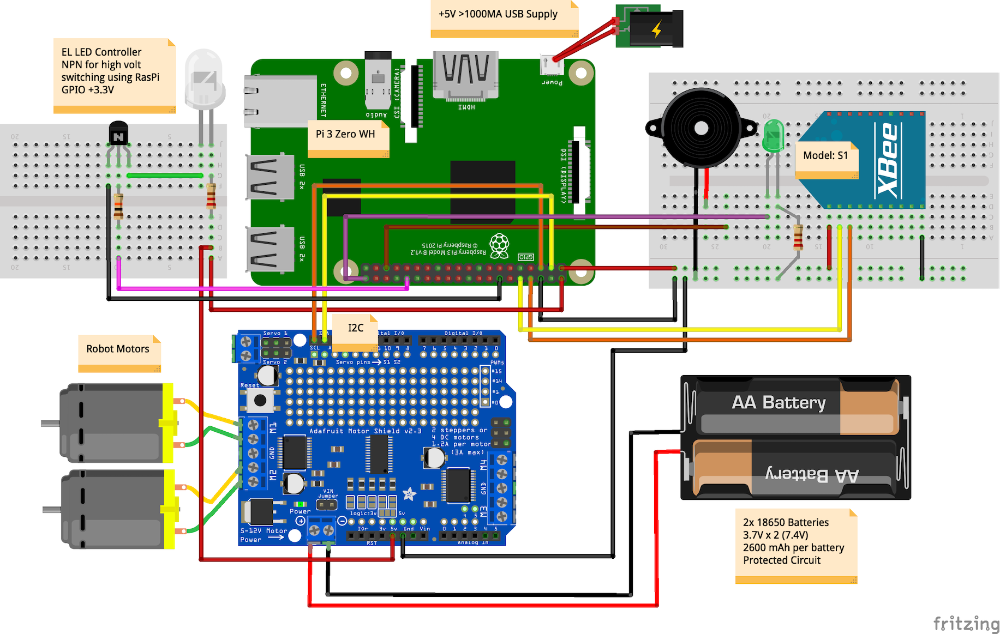

# raspi3--15-joystick-controlled-xbee-comm-robot

This tutorial is a piecing together of the following projects to formulate the basis for a robot and
associated robotic control:

1. 00-blink-led
2. 03-read-button-press
3. 04-gui-buzzer
4. 11-xbee-send-receive
5. 13-arduino-motor-shield-integration
6. 14-joystick-with-adc

This tutorial uses an analog joystick with an Analog to Digital Controller (ADC) MCP3008 IC as a base
station to remotely control a robot hosting a Raspberry Pi 3 Zero WH, Arduino Motor Shield, XBee radio,
Piezo buzzer, +5V power regulator, USB charger, and 4x AA batteries.

The following diagram depicts the control station (base station) with the 4-way analog joystick plus
button (which triggers the piezo buzzer as a horn on the robot):


For the Robot, the following schematic applies:



## Control Station

The controller is a simple analog joystick with button press. The Raspberry Pi 3 does not have analog
inputs and we therefore have to use an MCP3008 Analog to Digital Converter (ADC) chip. In order to do
so, the SPI interface on the Raspberry Pi must be enabled in order for the Pi to effectively communicate
with the MCP3008 using the SPI interface. In addition, the serial interface must be enabled in order for
the XBee device to be used.

### Controller -- Enabling Serial and SPI Interfaces

Once you've wired the devices appropriately, trigger the Raspberry Pi configuration utility:

```bash
$ sudo raspi-config
```

In order for the Raspberry PI to be able to use the UART ports (GPIO14/PIN8 and GPIO15/PIN10),
they first need to be removed from serial console use (default for the Raspbery PI). Once the
configuration utility is showing, navigate to "5 Interfacing Options" -> "P6 Serial", and select
"No" for all options to enable.

To enable SPI, navigate to "5 Interfacing Options" -> "P4 SPI", and select "Yes" to enable the
SPI interface. Again, do not elect to reboot (yet), but you can quit the configuration utility at
this time.

Once the configuration utility closes, ensure the UART is enabled. Open the `config.txt` file
and search for `enable_uart`, and ensure it is set to "1":

```bash
$ sudo vim /boot/config.txt
# search for and ensure the following line exists:
#   enable_uart=1
```

Next you can trigger a reboot of the Raspberry PI for the new settings to take effect:

```bash
$ sudo reboot
```

At this point (upon reboot) your SPI and Serial interfaces should be ready for use.

### Controller -- Python Virtual Environment Setup

Next we'll install a virtual environment (this requires Python 3):

```bash
$ sudo pip3 install virtualenv
$ virtualenv .env
$ .env/bin/activate

# verify you are using Python 3
$ python --version
# should output something similar to:
#   Python 3.5.3
```

Once the virtual environment has been configured, install the respective packages needed
for the tutorial:

```bash
$ pip install -r requirements.txt
```

### Controller -- Execution

Now that you have the circuit wired, SPI/Serial connected, and your Python 3 and associated dependencies
installed, you can kick off the script:

```bash
$ python controller.py
```

Your joystick and control station are now ready for use. We'll next power on the robot for control.

## Robot

The robot is comprised of several components to enable remote communication, power, and compute. Similar
to the control station, several interface capabilities must be enabled.

### Robot -- Enabling Serial and SPI Interfaces

Once you've wired the devices appropriately, trigger the Raspberry Pi configuration utility:

```bash
$ sudo raspi-config
```

In order for the Raspberry PI to be able to use the UART ports (GPIO14/PIN8 and GPIO15/PIN10),
they first need to be removed from serial console use (default for the Raspbery PI). Once the
configuration utility is showing, navigate to "5 Interfacing Options" -> "P6 Serial", and select
"No" for all options to enable. Quit the configuration utility, but do not yet reboot.

Once the configuration utility closes, ensure the UART is enabled. Open the `config.txt` file
and search for `enable_uart`, and ensure it is set to "1":

```bash
$ sudo vim /boot/config.txt
# search for and ensure the following line exists:
#   enable_uart=1
```

Next you can trigger a reboot of the Raspberry PI for the new settings to take effect:

```bash
$ sudo reboot
```

At this point (upon reboot) your Serial interface should be ready for use.

### Robot -- Python Virtual Environment Setup

Next we'll install a virtual environment (this requires Python 3):

```bash
$ sudo pip3 install virtualenv
$ virtualenv .env
$ .env/bin/activate

# verify you are using Python 3
$ python --version
# should output something similar to:
#   Python 3.5.3
```

Once the virtual environment has been configured, install the respective packages needed
for the tutorial:

```bash
$ pip install -r requirements.txt
```

### Robot -- Launch at Boot

Given the robot is presumably a remote, headless device, you need to configure the script to run
automatically on boot. In order to enable this, edit the `/etc/rc.local` file to include the commands
needed to launch the script when the Raspberry Pi boots:

```bash
# assuming the code is in the pi user Desktop directory
cd /home/pi/Desktop/raspi-projects/15-joystick-controlled-xbee-comm-robot
. .env/bin/activate
python robot.py
```

Next you should be able to reboot the Pi.

### Robot -- Execution

When the Raspberry Pi boots, it will take a minute for the loader process to complete. Once the
Raspberry Pi is fully loaded and script executed, you should see the LED light up solid indicating
the robot is ready to receive commands.

## Usage

When the base station code is launch and the robot boots fully (LED lights green), you should be ready
to control the robot. Move the joystick around to see the robot move, and click the joystick to hear
the Piezo buzzer trigger, simulating a horn.
