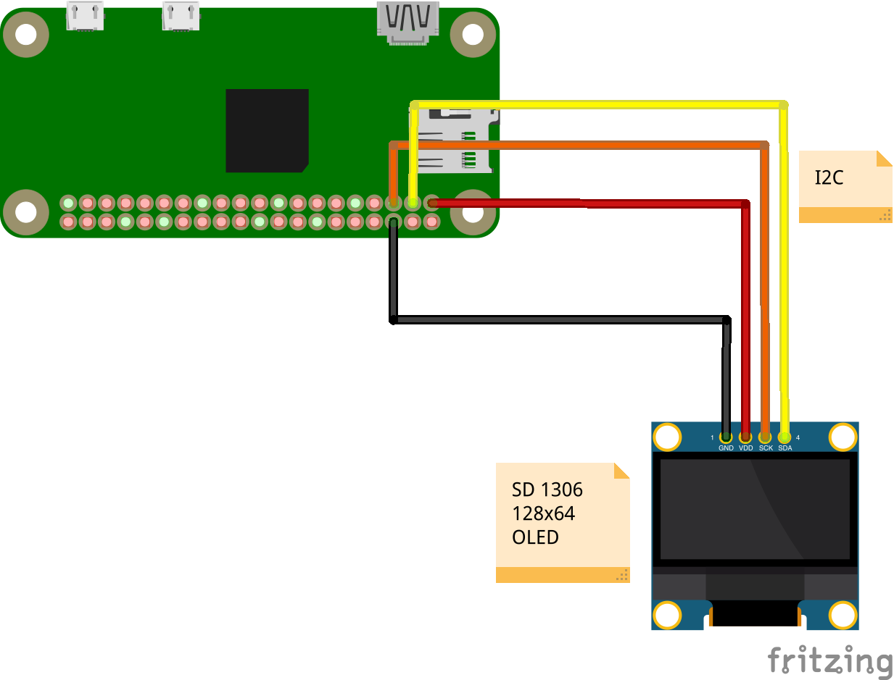

# raspi3--22-oled-display

Print various information on an OLED display. The following devices are expected:

- **128x64 OLED Display**: OLED display with SSD 1306 driver chip.
- **Raspberry PI**: This example uses a Raspberry PI 3 Zero WH device.

Assumes the following wiring - note that it is not ideal to utilize the Raspberry Pi 3.3V output pins
as they are not likely to be sufficient to support longer-term current draws (it is better to utilize
a dedicated +3.3V external power source for this effort):

- OLED VCC to RasPi +3.3V
- OLED GND to RasPi GND
- OLED SDA to RasPi SDA
- OLED SCL to RasPi SCL

The following sites/links were useful in crafting this repository source code:

- [https://learn.adafruit.com/monochrome-oled-breakouts/python-usage-2](https://learn.adafruit.com/monochrome-oled-breakouts/python-usage-2)
- [https://unix.stackexchange.com/questions/119126/command-to-display-memory-usage-disk-usage-and-cpu-load](https://unix.stackexchange.com/questions/119126/command-to-display-memory-usage-disk-usage-and-cpu-load)

First, prerequisites must be installed:

```bash
$ sudo apt-get -y install python3-pip
$ sudo apt-get -y install python3-pil
```

Next, install Python libraries required for the operation of the OLED display within a virtual environment:

```bash
$ pip3 install virtualenv
$ python3 -m virtualenv .env
$ . .env/bin/activate
$ pip install -r requirements.txt
```

To run the tutorial, which will display system information, run the script:

```bash
$ python3 display_info.py
```

After running the script, you should see some text printed on the OLED display corresponding to system
performance and IP information of the Raspberry Pi instance. The text should update regularly/frequently
based on the changing load/profile of the Raspberry Pi device.

## Running on Boot

This script could be useful for running automatically on Raspberry Pi boot (e.g. for displaying IP information
on boot so you know how to reach the device if it is not assigned a static IP address by your DHCP server).
To do so, edit the file `/etc/rc.local` and add the following right before the final `exit 0` directive:

```bash
...
sudo i2cdetect -y 1
sudo python3 /home/pi/display_info.py
exit 0
```

Note that the `i2cdetect` command is placed in order to free any occupied sessions/lines associated with the
I2C communication with the OLED device. This can likely be circumvented by having the Python script handle
the OLED display release itself on startup.

Additionally, in order for this to work as expected, the Python packages installed as part of the virtual
environment would need to be accessible. You can either source the environment in this script the same way
that you did when you ran the code previously/standalone, or update to install the Python packages using
`pip` globally for the system so they are accessible.

## Circuit Diagram


