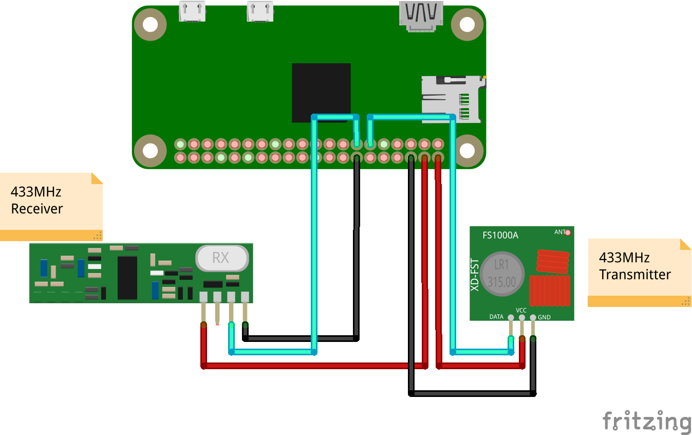

# raspi3--23-rf-433mhz-tx-rx

Communicate between 2x 433MHz devices (transmitter/receiver) using a Raspberry Pi. The following devices are
expected:

- **433MHz Transmitter**: 433MHz RF transmitter device.
- **433MHz Receiver**: 433MHz RF receiver device.
- **Raspberry PI**: This example uses a Raspberry PI 3 Zero WH device.

Assumes the following wiring - note that it is not ideal to utilize the Raspberry Pi 5V output pins
as they are not likely to be sufficient to support longer-term current draws (it is better to utilize
a dedicated +5V external power source for this effort):

**RF Transmitter**
- RF Transmitter VCC to RasPi +5V
- RF Transmitter GND to RasPi GND
- RF Transmitter DATA to RasPi GPIO17

**RF Receiver**
- RF Receiver VCC to RasPi +5V
- RF Receiver GND to RasPi GND
- RF Receiver DATA to RasPi GPIO27

The following sites/links were useful in crafting this repository source code:

- [https://pypi.org/project/rpi-rf/](https://pypi.org/project/rpi-rf/)
- [https://github.com/milaq/rpi-rf](https://github.com/milaq/rpi-rf)
- [https://github.com/mrpjevans/rfchat/blob/master/rfchat.py](https://github.com/mrpjevans/rfchat/blob/master/rfchat.py)

There are 2 scripts/parts to this repository - a transmission script and a receive script. First, prerequisites must be
installed to enable both sides:

```bash
$ sudo apt-get -y install python3-pip
```

Next, install Python libraries required for the operation of the RF devices within a virtual environment:

```bash
$ pip3 install virtualenv
$ python3 -m virtualenv .env
$ . .env/bin/activate
$ pip install -r requirements.txt
```

Start the RF receiver first in a terminal session - this will continuously listen for new data:

```bash
$ python3 receive.py
```

Finally, run the transmitter script, which will send a sequence of characters out over the 433MHz frequency:

```bash
$ python3 transmit.py
```

In your `receive.py` terminal session, you should see the receiver obtain the data and print it to the screen!

## Next Steps

This tutorial assumed both the RF transmit and receive devices were attached to the same Raspberry Pi device. This
is likely not a realistic use case, so the next thing to do would be to split the transmitter from the receiver and
have them run from separate Pi devices to simulate real-world use cases.

Also, the RF transmit/receive devices are not very useful at longer ranges in their out of box form. To address this,
attach an antenna to each of the devices that is approximately a quarter of the wavelength of the carrier wave for
the 433MHz RF module (approximately 17cm/6.69in). This should drastically increase the range of transmitting and
receiving data.

Finally, as mentioned, an external power supply is preferred for the antenna devices. This drastically reduces the
chance that the shared power supply total power is reduced by the Raspberry Pi, possibly causing loss of data during
transmission.

## Circuit Diagram


